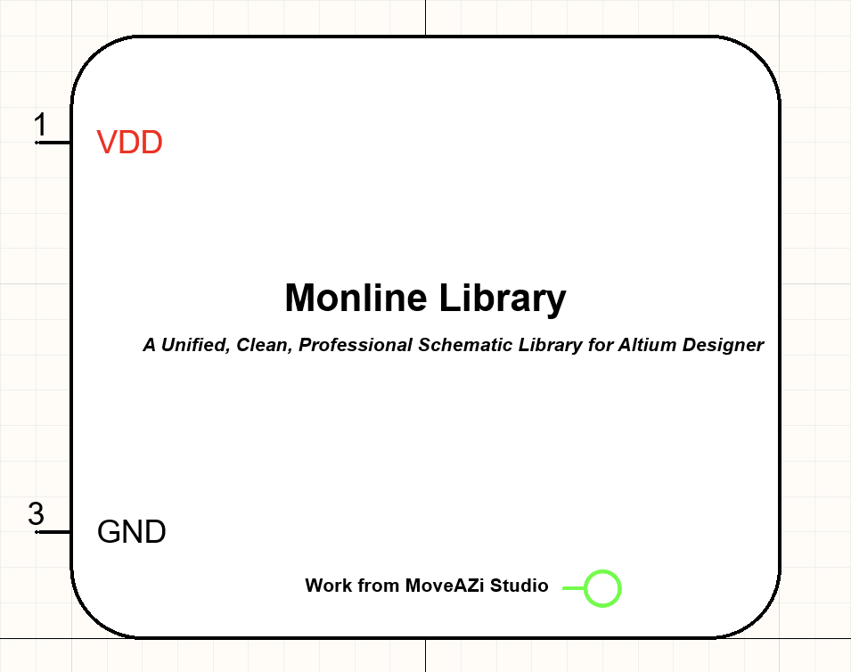

# Mono Line Lib — A Unified, Clean, Professional, Harmonized Schematic Library for Altium Designer
### The Ultimate Minimal, Beautiful, Rule-Driven Electrical Symbol System

Monoline is not “just another component library”.  
It is a **design language**, a **visual standard**, and a **complete schematic philosophy**.

Most public component libraries suffer from:
- random inconsistent grids  
- mismatched fonts  
- weird colors  
- messy shapes  
- multiple duplicate symbols  
- unreadable pin groups  
- ugly wire colors (default Altium blue)  
- symbols drawn with no respect to functional clarity  
- components that look manufactured by hundreds of different people  

Monoline solves all of these problems by enforcing a **strict, elegant, professional** standard for all symbols, text, spacing, pin layout, and color usage.

---

# ⭐ Philosophy of Monoline

> **A schematic must be beautiful, readable, aligned, minimal, and harmonized.  
Not a chaotic patchwork of mismatched symbols.**

Monoline believes in:
- **Zero visual noise**  
- **Zero unnecessary decoration**  
- **Everything aligned on a universal grid**  
- **One consistent style from smallest diode to biggest MCU**  
- **True black-and-white schematics**  
- **Perfect print compatibility**  
- **Universal clarity — any engineer can read it instantly**

---

# 🎯 Goals of the Library
Monoline is built with the following goals:

### ✔ A universal visual identity  
All components share:
- same fonts  
- same colors  
- same grids  
- same corner radiuses  
- same symbol architecture  

### ✔ High readability  
Pin names, pin groups, and power pins are immediately recognizable.

### ✔ Schematic-first design  
Unlike many libraries that focus on PCB first, Monoline focuses on **schematic clarity**.

### ✔ Minimalistic but complete  
Simple when possible  
→ expressive when needed (functional group boxes, internal icons, etc.)

### ✔ Ready for A4 print  
Every page remains beautiful and readable when printed grayscale.

---

# 🎨 Color System — STRICT RULES
Monoline uses a legendary ultra-minimal palette:

## 1) BLACK (primary)
Used for:
- all wires  
- all symbols  
- all outlines  
- all pin lines  
- all component text  
- all internal icons  
- all buses, ports, net labels  
- GND symbols  

**Reason:**  
Black lines have the highest contrast and remain perfect in printing.

---

## 2) pure RED (RGB 255,0,0)
**Not Altium default red. Must be exact RGB 255,0,0.**

Used ONLY for:
- Power ports (VCC, VDD, VREF, +5V, +12V, etc.)
- Power pins of ICs  
- Positive supply entry points on blocks

**Never used for:**
- GND  
- Signals  
- Labels  
- Notes  
- Component outlines  

**Reason:**  
Power rails must visually pop out with a single glance.

---

## 3) WHITE interiors
Used for filling internal areas of:
- Rounded-corner IC functional blocks  
- Large complex chips  
- Internal logic regions  
- Sub-blocks of SoCs, PMICs, codecs, etc.

**Reason:**  
White interior improves grouping clarity and helps engineers instantly see logical boundaries.

---

# 📐 Line Width Rules (Strict)
To keep consistency:

| Item | Width |
|------|--------|
| Component outline (normal) | Small |
| Component outline (big ICs) | Small or Smallest |
| Internal dividers | Smallest |
| Rounded boxes | Smallest |
| Power symbols | Smallest |
| Generic discrete elements lines | Smallest |

**Never use medium/thick lines in schematics.**

---

# 📏 Grid, Pin Length & Spacing Rules

These rules apply to **library and schematic** both:

- **Primary grid:** 100 mil  
- **Pin length:** 200 mil  
- **Internal block spacing:** 100 mil increments  
- **Label offsets:** multiples of 50–100 mil  
- **Component snapping:** ON  
- **Pin-to-pin snap:** ON  

**Why 100 mil?**  
Because:
- It is the industry classic  
- It keeps all symbols clean  
- It avoids half-grid misalignments  
- It prevents sloppy placement  
- It prints better  

---

# 🧱 Structural Rules for Symbols

## ✔ 1) Discrete Components
Items like:
- resistors  
- capacitors  
- diodes  
- LEDs  
- Zeners  
- BJTs  
- MOSFETs  
- transformers  
- inductors  
- crystals  
**DO NOT** get a rectangle box.

They are drawn **as actual symbols only** (clean black lines).

---

## ✔ 2) Simple ICs
- One rectangle  
- No icons inside  
- Pins around the box  
- Name under the symbol  
- Power pins grouped (prefer left side or top)  
- Pin names always outside  

---

## ✔ 3) Multi-Function / Complex ICs
Such as:
- STM32 / ESP32 / ATmega  
- PMICs  
- Audio codecs  
- Switch-mode drivers  
- USB hubs  
- CAN/LIN transceivers  
- Sensor hubs  
- Automotive ECUs  

Rules:
- Use white-filled rounded blocks  
- Optional functional icons  
- Group pins by function  
- Place description text inside blocks  
- Component name **ALWAYS** goes under the symbol  
- Long names allowed under the block  
- Use Arial 10 Bold for main name  

---

## ✔ 4) Functional Block Logic
For large ICs:
- Create blocks for GPIO, power, analog, comms, memory  
- Separate left/right logically  
- Use internal titles in Arial 8 bold  

---

# 🔠 Font Rules (Mandatory)

Every text in the library and schematic uses:

| Use | Font | Size | Style |
|------|------|------|--------|
| Designator | Arial | 10 | Bold |
| Component Name | Arial | 10 | Regular |
| Pin Names | Arial | 10 | Regular |
| Parameters | Arial | 8–10 | Regular |
| Notes | Arial | 8 | Regular |
| Internal block titles | Arial | 8 | Bold |
| Small internal labels | Arial | 6–8 | Regular |

**NO other fonts.  
NO Times New Roman.  
NO Segoe.  
NO monospace unless required for ASCII art.**

---

# 📄 Altium Recommended Settings
Set these in **Preferences → Schematic → Graphical Editing**:

- Wire color → Black  
- Port color → Black  
- Bus color → Black  
- Junctions → Black  
- Power port color → custom RGB (255,0,0)  
- Use “override document font settings” = ON  
- Font → Arial Regular  
- Grid = 100 mil  
- Cursor snap = ON  

---

# 📁 Library Philosophy — Schematic-First
Monoline library focuses on schematic readability.  
PCB footprints:
- may be taken from vendor libraries  
- or KiCad libs  
- or open-source verified sets  
- or custom made  

The schematic symbol architecture takes priority.

---

# 🔧 How to Use the Library

1. Download Monoline repository  
2. Add `Monoline.SchLib` to your Altium project  
3. Update your global prefs (fonts, colors, grid)  
4. Draw schematics using only Monoline symbols  
5. Keep your project consistent with Monoline rules  
6. Use black wires, black labels, black buses  

---

# 🔍 Visual Harmony Principles

- left-aligned pins = inputs  
- right-aligned pins = outputs  
- bottom pins = configuration/power/ground  
- top pins = reference inputs or power entries  
- group similar pins together  
- keep repeated block layouts consistent  
- avoid mirror-flipped text  
- prefer symmetry whenever possible  

---

# 🧩 Multi-Part Symbols

For complex devices:

- GPIO blocks separated  
- Analog front-end separated  
- Communication interfaces separated  
- I²C blocks grouped  
- Power management inside dedicated white boxes  
- Clear internal functional hierarchy  

---

# 📜 Naming Conventions

- Designators in the schematic ALWAYS in uppercase  
- Functional block names in Title Case  
- Component names uppercase or PascalCase  
- Internal labels short and simple  

Examples:

MCU_Core
Power_Stage
LIN_Interface
USB_PHY
OSC_Block

---

# 🖨 Print Fidelity Rules
Monoline is designed for perfect printing:

- Pure black wires print crisp  
- No gray artifacts  
- Red power pins remain visible even on grayscale printers  
- 100 mil grid avoids compression artifacts  

---

# 🧬 Why Monoline Was Created

Because existing libraries are:
- ugly  
- unaligned  
- impossible to read  
- full of mixed symbols and line widths  
- polluted with rainbow nets  
- inconsistent in pin spacing  
- barely printable  
- frustrating for teams  

Monoline is the cure:  
**a universal and disciplined visual language for electronics.**

---

# 📚 Wiki Structure 
---

---

# 📜 License

    Apache-2.0 license

---

# 🏁 Final Note
Monoline is more than a library.  
It is a **professional engineering standard**, ensuring every schematic you create is:

- clean  
- harmonized  
- beautiful  
- consistent  
- readable  
- scalable  
- printable  
- modern  
- and timeless  

A schematic is a language —  
Monoline makes it elegant.
